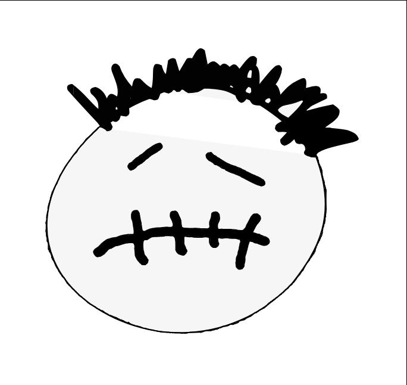

<div align="center">


<br><br>



### Librería de estilos CSS inspirada en el álbum *ASTROWORLD* de Travis Scott

[Documentación](https://manuelmv15.github.io/) · [Componentes](https://manuelmv15.github.io/componentes/componentes.html) · [Formularios](https://manuelmv15.github.io/formularios/formularios.html) · [Layout](https://manuelmv15.github.io/layout/layout.html) · [Utilidades](https://manuelmv15.github.io/utilidades/utilidades.html)


</div>

---

## ¿Qué es AstroW?

AstroW es una librería de estilos escrita en SCSS. Trae componentes listos para usar (botones, tarjetas, alertas, badges, barras de navegación), estilos para formularios y utilidades de layout (grid, flexbox, colores y texto). Su paleta y tipografía están tomadas de la estética de *ASTROWORLD*.

## Instalación

### Opción 1: CDN (jsDelivr)

Agrega esta línea dentro del `<head>` de tu HTML:

```html
<link rel="stylesheet" href="https://cdn.jsdelivr.net/gh/manuelmv15/AstroW/css/style.css">
```

### Opción 2: Descargar el repositorio

```bash
git clone https://github.com/manuelmv15/AstroW.git
```

Luego enlaza el archivo compilado `css/style.css`:

```html
<link rel="stylesheet" href="AstroW/css/style.css">
```

## Ejemplo rápido

```html
<!DOCTYPE html>
<html lang="es">
<head>
  <meta charset="UTF-8">
  <meta name="viewport" content="width=device-width, initial-scale=1.0">
  <link rel="stylesheet" href="https://cdn.jsdelivr.net/gh/manuelmv15/AstroW/css/style.css">
  <title>Mi página con AstroW</title>
</head>
<body>
  <div class="container">
    <div class="alert alert-success">¡AstroW está funcionando!</div>

    <div class="card">
      <div class="card-body">
        <h3 class="card-title">Tarjeta</h3>
        <p class="card-text">Contenido de ejemplo dentro de una tarjeta.</p>
        <a href="#" class="btn-primary">Botón principal</a>
        <a href="#" class="btn-outlined-blue">Botón con borde</a>
        <span class="badge-solid-orange">Nuevo</span>
      </div>
    </div>
  </div>
</body>
</html>
```

## Qué incluye

| Módulo | Clases principales |
|---|---|
| **Botones** | `.btn`, `.btn-{color}`, `.btn-outlined-{color}`, `.btn-complement-{color}`, tamaños `-sm` `-md` `-lg` `-xl` |
| **Badges** | `.badge-solid-{color}`, `.badge-soft-{color}`, `.badge-outlined-{color}`, `.badge-inverted-{color}` |
| **Alertas** | `.alert`, `.alert-success`, `.alert-info`, `.alert-warning`, `.alert-danger` |
| **Tarjetas** | `.card`, `.card-body`, `.card-title`, `.card-subtitle`, `.card-text`, `.card-img-top` |
| **Layout** | `.container`, `.col-{n}` (grid de 12 columnas), `.justify-{valor}`, `.flex-dir-{valor}`, `.flex-wrap` |
| **Colores** | `.bg-color-{color}`, con tonos `-light-1` a `-light-9` y `-dark-1` a `-dark-9` |
| **Texto** | `.text-is-left`, `.text-is-centered`, `.text-is-right` |

La guía completa, con ejemplos de cada componente, está en la [documentación](https://manuelmv15.github.io/).

## Paleta de colores

**Colores del tema ASTROWORLD**

| Nombre | Color | Hex |
|---|---|---|
| `orange` |  | `#f4a529` |
| `yellow` |  | `#fad860` |
| `red` |  | `#790707` |
| `pitch` |  | `#9e6555` |
| `gray` |  | `#acc1d3` |
| `blue` |  | `#2a4058` |

**Colores funcionales**

| Nombre | Color | Hex |
|---|---|---|
| `primary` |  | `#00d1b2` |
| `link` |  | `#4258ff` |
| `info` |  | `#66d1ff` |
| `success` |  | `#48c78e` |
| `warning` |  | `#ffb70f` |
| `danger` |  | `#ff6685` |

**Tipografía:** *Spicy Rice* para títulos y *Outfit* para el texto.

## Compilar desde el código fuente

Si quieres modificar los estilos, edita los archivos `.scss` de la carpeta `AstroW/` y compila con Gulp:

```bash
npm install
npx gulp
```

Gulp compila `AstroW/**/*.scss` a la carpeta `css/` y se queda vigilando los cambios.

## Estructura

```
AstroW/
├── AstroW/              # Código fuente SCSS
│   ├── base/            # Reset y estilos base
│   ├── componentes/     # Botones, tarjetas, alertas, badges, navbars
│   ├── formularios/     # Inputs, checks, rangos, grupos
│   ├── utilidades/      # Variables, colores, grid, flex, tablas
│   └── style.scss       # Punto de entrada
├── css/style.css        # CSS compilado (el que se enlaza)
├── docs/                # Páginas de documentación
└── gulpfile.js
```

## Autores

| Nombre | Carnet | GitHub |
|---|---|---|
| Jeferson Alexis De La Cruz Ventura | DV23003 | [@JefersonDeLaCruz](https://github.com/JefersonDeLaCruz) |
| Carlos Manuel Meléndez Villatoro | MV23036 | [@manuelmv15](https://github.com/manuelmv15) |
| Cristian Alexis Ventura Ventura | VV23011 | [@kristiankovic](https://github.com/kristiankovic) |
| David Elías Romero Claros | RC23030 | [@luxoritur](https://github.com/luxoritur) |

## Licencia

Uso libre. El proyecto no tiene una licencia formal.

<sub>Proyecto sin afiliación con Travis Scott ni Cactus Jack. El nombre y la estética son un homenaje al álbum *ASTROWORLD*.</sub>
